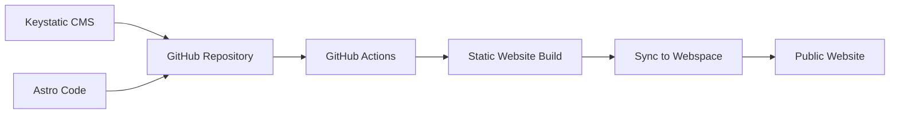

# Waldkindergarten Website

This repository contains the static website for the Waldkindergarten.

The website replaces an old Joomla installation that was no longer up to date and had security issues. The new setup is intentionally simple, static and low-maintenance.

## Background

This project is maintained voluntarily by me, [mhaertwig](https://github.com/mhaertwig), in my free time.

The kindergarten was founded by my father-in-law and is now gradually being handed over to the next generation. The goal of this website is to provide a secure, modern and easy-to-maintain foundation for the coming years.

Contributions are welcome.

## Architecture

The website is built with [Astro](https://astro.build/) and uses [Keystatic](https://keystatic.com/) as a Git-based CMS.

Content is stored as files in this GitHub repository. When content or code changes, GitHub Actions builds the static website and syncs the generated files to the kindergarten’s webspace.

## Security

The website is static, does not use a database and does not set cookies.
Dependencies are updated with Renovate.

If you discover a security issue, please contact me via GitHub or the kindergarten directly.

## License

The source code is licensed under the MIT License.
